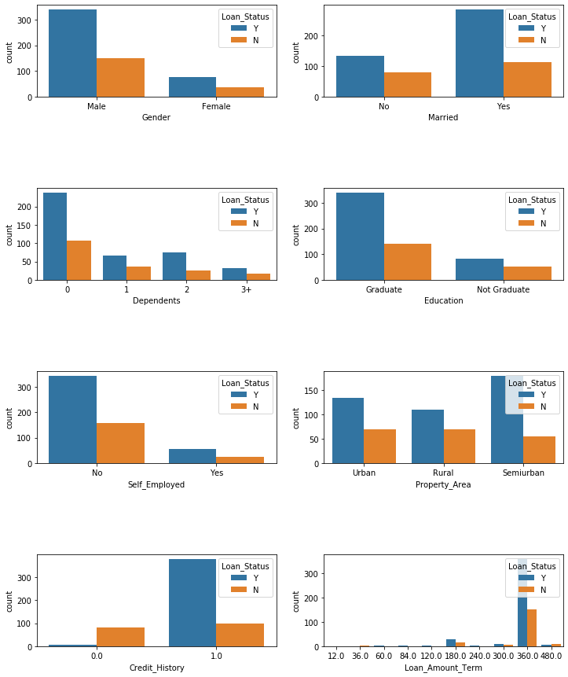

# Loan_prediction
Machine learning project in Python using sciket-learn and Flask; to predict loan eligibility using mock data

## Getting Started

This app is deployed on Heroku available at: [https://loanpredic.herokuapp.com/](https://loanpredic.herokuapp.com/)

The original dataset was sourced from [https://www.kaggle.com/](https://www.kaggle.com/altruistdelhite04/loan-prediction-problem-dataset?select=train_u6lujuX_CVtuZ9i.csv)

### Prerequisites

A requirments.txt file was included with all the required libraries needed for running this project 

## Overview

- notebooks/Loan_predictor.ipynb loads in the source data and tests different models for accuracy to choose which model to save and use with the app
- model/train.py and model/cluster.py can be called from the root directory to train and save the models using python library pickle 
- app.py houses the flask app that will allow users to predict whether they can be approved or declined for a loan reflecting the truth behind the mock data 
- templetes/index.html carries the html used for building front end interface where users can fill out a form 
-static/js/app.js collects the user input and cleans it up to match the data format needed by the model to output a prediction 

## Approval trends in data 
As shown below, there was clear trends shown by the data 

